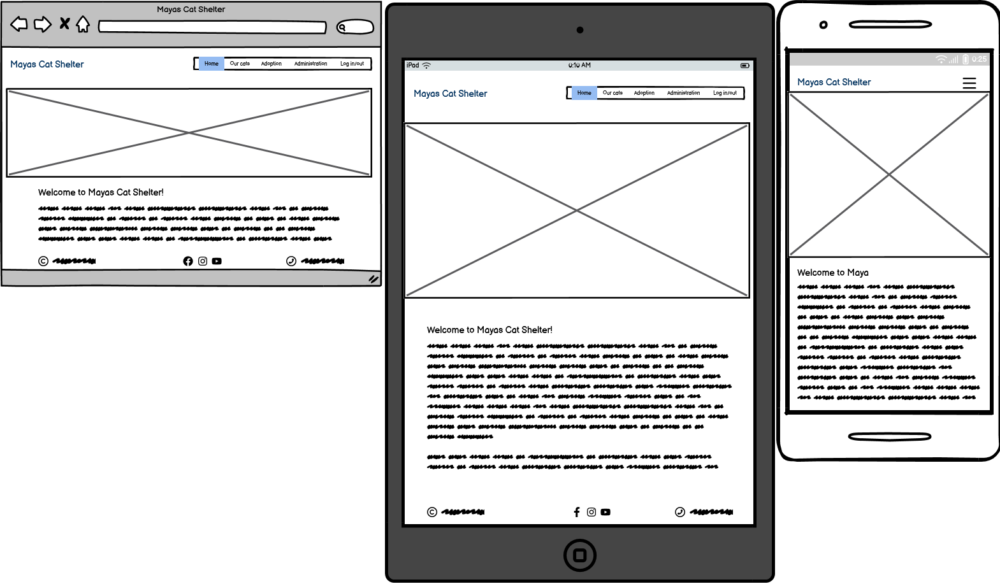
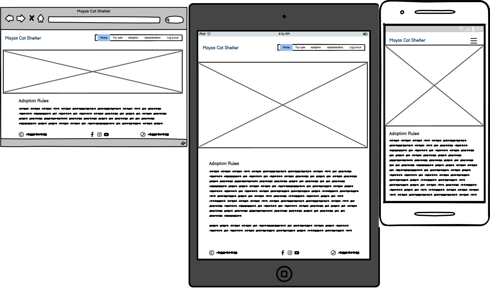
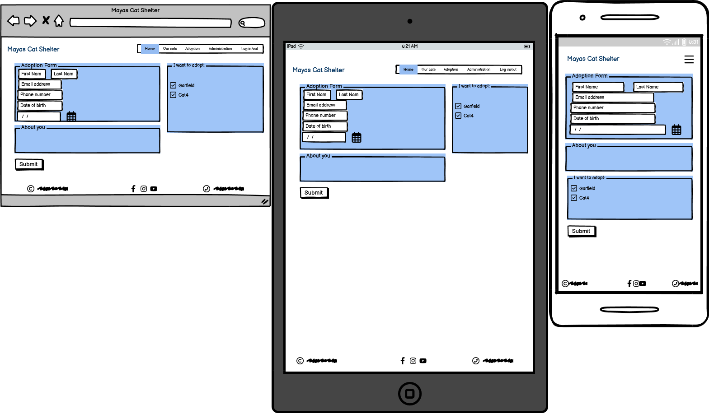
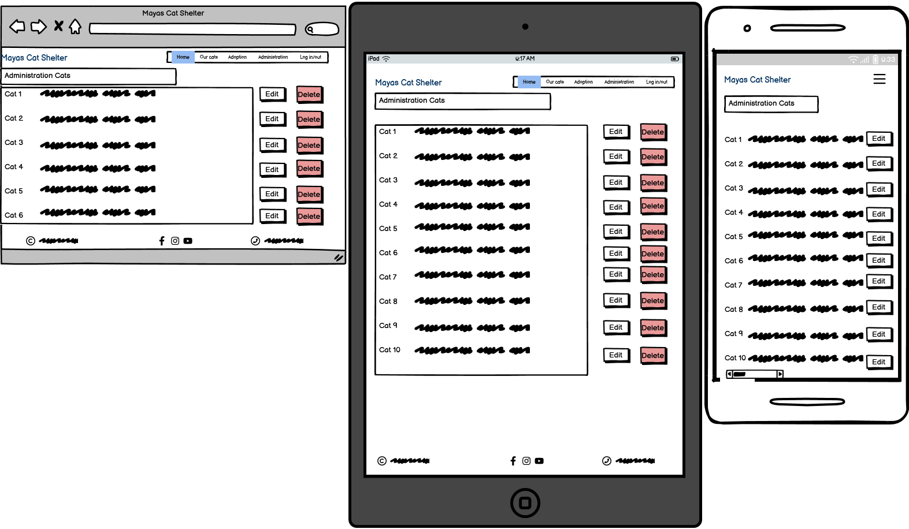
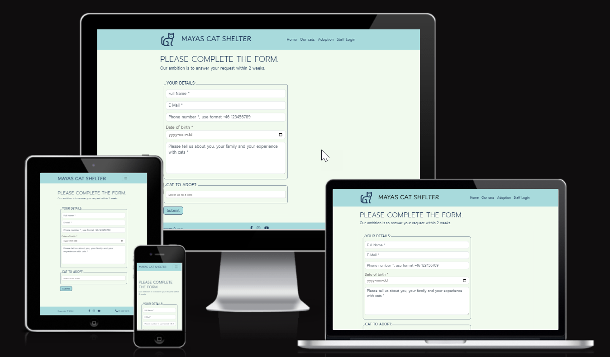
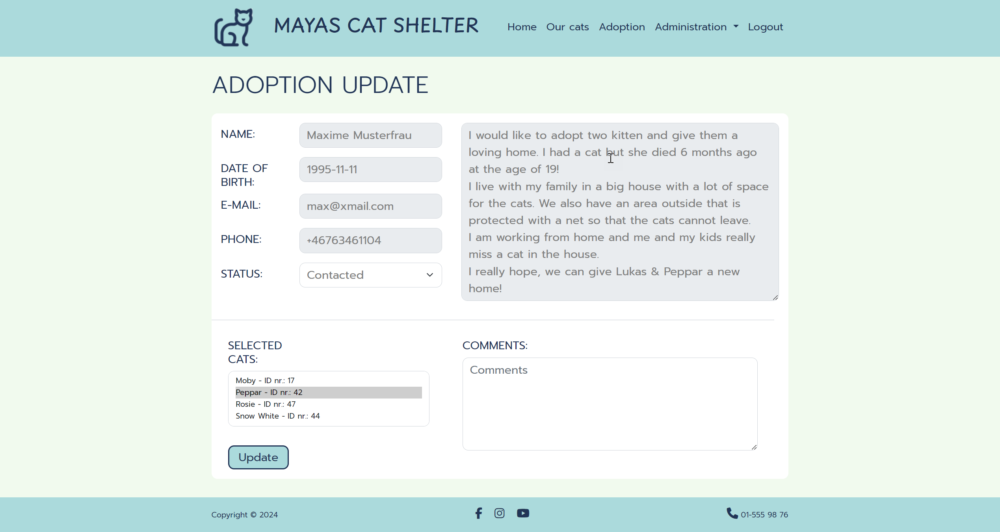
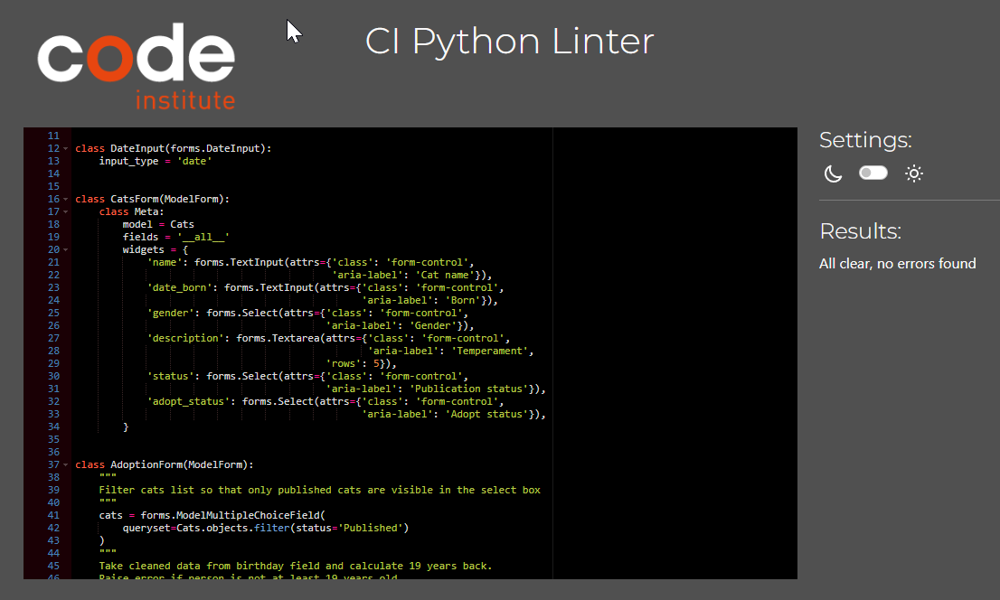
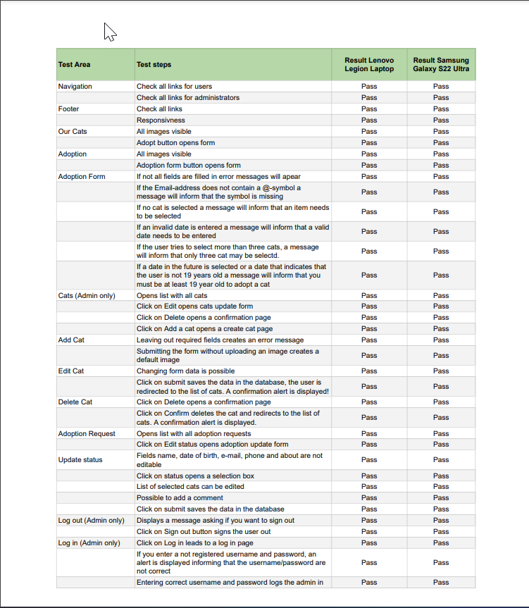
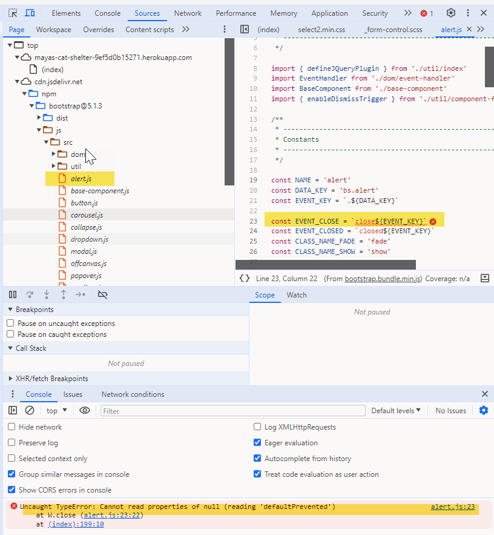

# Mayas Cat Shelter

By Claudia Bergstaller

## Introduction

### Project Description

[Mayas Cat Shelter](https://mayas-cat-shelter-9ef5d0b15271.herokuapp.com/) is a fictional cat shelter in the city of Gävle, Sweden. The structure, set-up as well as the background stories of the cats are losely based on a real local cat shelter, Gefle Katthem. 

Each page includes a responsive navigation bar as well as a footer with copyright information, social media links and a fictional telephone number. 
The start page includes an image carousel with two images which link to a page with available cats respective a page with information about the adoption process. 
From both pages a link to an adoption form is available for the user. 

Full CRUD functionality is reserved for the administrator role who can log-in/log-out in the navigation bar. When a user is logged in, an additional dropdown menu link is available to administrate cats (Create, Read, Update, Delete) as well as the incoming adoptions requests. However, the data in these requests is not editable but the user/administrator can change the status log and add comments. 
More details can be found in the respective Features section.  

## UX

Mayas Cat Shelter is for all people who love cats and consider to adopt one. 
Stumbling into the cat adoption world myself by accident, cat lovers come in all sizes, shapes, education levels, cultural backgrounds and ages. 
So, target group for this website are all people who love cats, but of course merely those who live close to the cat shelter. 

## Design

### Colors

The websites's color scheme uses soft tones that harmonize very well with each other. I wanted to have a color scheme that includes red and blue tones to represent female and male cats and found a palette that blends some calming greenish color with the mentioned red and blue and makes it look very appealing.

### Typography

I wanted to add a logotype representing a cat and found a nice image that I used for both the logotype, the favicon and as placeholder image. The font "Playpen" works very well with this logotype. For the body text I used "Prompt" with has a nice rounded form and is very well readable even on small screens. 

## Wireframes

Wireframes were created for desktop, iPad and smartphones using Balsamiq.

Home Page

Our Cats

Adoption

Adoption Form

Administration Cats

Administration Adoption Requests

## Agile 

Agile Methodology was used during the project.
User stories were created at project start, and prioritized according to MOSCOW way of working. 
Github was used to document the user stories by using the build in Issues resp. project functionality.
For each user story a list of tasks and acceptance criterias was created.
Working progress was illustrated in a canban board.
All user stories labelled "Must have" have been closed. 
Open user stories have been collected in the backlog section. 

The project is open for public access and can be visited here.

## Features

### Navigation

The responsive navigation bar on top of the page includes links to the Home Page, Our Cats, Adoption, Staff Login. When a user is logged in, a Logout link is visible instead as well as a dropdown link with two sections, one to the cats administration page and the other one to a list of all adoption requests.
On smaller screens the links are replaced with a clickable toggle icon.

### Footer

The responsive footer sticks to the bottom of each page and includes copyright information, links to the social media platforms, Facebook, Instagram and Youtube and a fictional telephone number.

### Home Page

The Home page is the starting point for users. A carousel shows two alternating cat images with links to either the cats page or the adoption page. Some descriptive text about the cat shelter can be found below the carousel. 

### Our cats

On this page all available cats are listed with:
- Name (colored in red (female) or blue (male))
- Approx. birth date (originally I used a date field but realized in a later stage that cat shelters resp. vets often only can guess when a homeless cat is born so I updated this field to a textfield)
- Gender (depending on gender, displayed in red (female) or blue (male))
- Background and Temperament
- Adoption status (when a cat is already adopted, the "Adopt" button is replaced with just some info text accordingly)
- Adopt Button that links to the adoption form

### Adoption

The adoption page includes information about what to consider when adopting a cat, the costs and the process steps.
On the bottom of the page a button links to the adoption form. 

### Adoption Form

The adoption form consists of two parts:
1. The user fills in Name, E-Mail, Phone, Date of birth and some information about themselves. 
2. The user selects up to three cats to adopt. It's also possible to search for cat names.

When clicking the submit button, the user will be redirected to the start page and a confirmation message will be displayed for 5 seconds. It is also possible to remove the message by closing it manually. 

### Administration for staff

When a staff member is logged in, the administration dropdown menu will be visible in the navbar.
Two options are available:

#### Administration Cats 

The staff member will see a table of all cats, both with status published or draft. 

The table contains the cat name, gender, adoption status and publication status. 

On the right side there's an edit and delete button for each row/cat. 
On top of the page, a "Add a cat" button links to the add cat form. To populate a new cat, name, gender need to be entered. Publication status as well as adoption status are mandatory, but have default values ("Draft" resp. "Ready for adoption"). If no image is uploaded, a default image with a cat silhoutte (same as logo and favicon) will be added. 

When the staff member clicks on the edit button in the cat table, the same form will be opened, but with the cat data pre-populated. 

When the staff member clicks on the delete button in the cat table, a confirmation page will be opened, asking for a confirmation to delete the cat. When the user confirms deleting, the cat will be deleted and the user redirected to the cat administration page. 
If the user clicks on Cancel, the user will be redirected back to the cat administration page. 

#### Administration Adoption requests

The staff member will see all adoption requests in card form, sorted by date. The idea with this page is that the staff can see at one glance all information about an adopter. 

A staff member can also edit the status of the adoption request, following the steps outlined on the adoption page, and add comments. 
Personal data of the adopter is not editable in this view! 

However, as there is the possibility that either the interested adopter or the cat shelter staff conclude that the choosen cat might not be the right one for this person, the cat selection list is editable for staff members. 

### Login/Logout

The navigation bar includes a "Staff Login" link for staff members to log in. This might not be best practise for real cases but it's the easiest way to log in for the project assessors at Code Institute.
However, I have removed the link to the "Sign in" page to avoid sign in attempts of page visitors. 
When a staff member is logged in, the "Staff Login" link will change to "Logout".

Non-staff users who try to access one of the administrator pages (add-cat, update-cat, delete-cat, update-status), will be redirected to the Login page.

## Future Features

There are many possibilities for further improvement to the website. 
Some suggestions and ideas are:
- Create a blog-like page with regular updates about the cats
- When the number of adopted cats increases, a separate page with these cats listed could be nice.
- Create a contact us page
- Create a page with information about how people can support the cat shelter, e.g. donations (money, food, cat trees, etc.) but also volunteer services.
- For administrator could the adoption request page developed further to include the complete adoption process with its several steps in digital form.
- A newsletter functionality could be included to keep supporters informed and so on.

## Information Architecture

### Relationship Diagram

### Data Models

#### Cats Model

id (PK): unique identifier for each cat

name (string): Name of the cat

date_born (string): month and year when cat is born

gender (choice): female or male

description (textfield): A description of the cats background and temperament

image (image upload to Cloudinary): picture of cat or placeholder image

status (choice): draft or published

adopt_status (choice): Not yet ready for adoption, ready for adoption, booked, adopted

date_created (date): set automatically to todays date

#### Adoption Model

id (PK): unique iedentifier for each adoption request

full_name: (string) Name

email (email field): Email 

phone (phonenumber): phone number

date_of_birth (date input): date, validates if adopter is 19 years or older

about_you (text area): Freetext field

cats (ManyToMany relationship to cats): to select up to three cats 

received (date): set automatically to todays date

status (choice): for admin to set according to where in the adoption process they are

comments (text field): for admin to fill in

#### CRUD Functionality
Administrator can create, read, update and delete cats
Administrator can read and update adoption requests
User can read non-restricted content

## Technologies used

### Languages
- HTML5
- CSS
- Python

### Technologies and programs
- IDE: Gitpod/VS Code
- Repository: GitHub
- Database: ElephantSQL
- Deployment: Heroku

### Software and frameworks

## Testing

### Validator Testing

#### HTML

No errors were returned when passing through the [W3C Markup validator](https://validator.w3.org/).
Details for each page can be found by clicking the expand button.
 

HTML Validation 

Homepage

Our Cats

Adoption

Adoption Form

Administration Cats

Administration Adoption Requests

Login

Logout

#### CSS

No errors were found when passing through the [W3C CSS Validator](https://jigsaw.w3.org/css-validator/) validator

#### Google Chrome Lighthouse Reports

These reports presents the results of Lighthouse testing to assess the performance, accessibility, best practices and SEO of Mayas Cat Shelter.

The tests were executed using the Google Chrome browser's DevTools.
Details for each page can be found by clicking the expand button.

Lighthouse Reports

Homepage

Our Cats

Adoption

Adoption Form

Administration Cats

Administration Adoption Requests

Login

Logout

#### Python validation
No errors were returned when passing through the [CI Python Linter](https://pep8ci.herokuapp.com/).
Details for each part can be found by clicking the expand button.
 

Python Linter 

model.py

forms.py

admin.py

urls.py

views.py

## Browser Testing

Functionality, links, layout, and responsiveness were tested with the following browsers without any major issues:

- Microsoft Edge Version 122.0.2365.92
- Firefox Version 122.0.1
- Brave Version 1.64.109
- Google Chrome Version 123.0.6312.58
  

## Manual Testing

Manual testing was performed on a Lenovo Legion Slim 7 and a Samsung Galaxy S22 Ultra.
Layout looked good on both devices. 

## Deployment

A Repository was created in Github, and apps and templates were developed using VS Code.
At an early stage a database on ElephantSQL was connected to the project as well als Cloudinary to store static files.
The following packages were installed in VS Code and added to the requirements.txt:

annotated-types==0.6.0
asgiref==3.7.2
cloudinary==1.37.0
crispy-bootstrap5==2023.10
dj-database-url==0.5.0
dj3-cloudinary-storage==0.0.6
Django==4.2
django-allauth==0.57.0
django-bootstrap-datepicker-plus==5.0.5
django-bootstrap-v5==1.0.11
django-cloudinary-storage==0.3.0
django-crispy-forms==2.1
django-jquery==3.1.0
django-phone-field==1.8.1
django-phonenumber-field==7.3.0
django-resized==1.0.2
django-summernote==0.8.20.0
gunicorn==21.2.0
oauthlib==3.2.2
phonenumbers==8.13.27
phonenumberslite==8.13.32
Pillow==10.1.0
psycopg2==2.9.9
pydantic==2.6.3
pydantic_core==2.16.3
PyJWT==2.8.0
python3-openid==3.2.0
requests-oauthlib==1.3.1
sqlparse==0.4.4

### The following steps were taken to deploy the app to Heroku:
- Create a new app on Heroku
- Choose an unique name for the app and select your region
- Click on Create App
- When ready, add config vars in the respective hidden field in the Settings tab.
- Add the buildpack "Heroku/Python"
- Select the Deploy tab and add connect to Github under Deployment method, select the repository that shall be deployed
- Finally, choose if you want to enable automatic or manual deployment. 
- Wait until the app is loaded and open your website.

## Known Bugs

### Adoption Form
There is some kind of bug in the phone field which removes the + symbol (for international numbers) when the user uses the autocomplete function or when you paste in the phone number. This results that the phone number always will be invalid when the user doesn¨t type the '+'. 
If you type in the phone number manually the validation works as expected. 

### Uncaught TypeError at alert.js
During page load an error occurs that is visible in the console but doesn't disrupt the function. However, this is a loaded js file from Bootstrap and cannot be fixed locally.

### Styling
Styling could be optimized, there are some font sizes and colors in the forms that don't match 100% but I have an issue with the display in the Google Developer Tool. When looking at the smalles item, a Galaxy Fold, the layout always looks completely distroyed. I spent a lot of time to fix that and only recently I noticed that something must be wrong with the Developer tool because all websites look the same ugly way. 

## Credits

#### Cats images:

#### Code Snippets & Tutorials:

